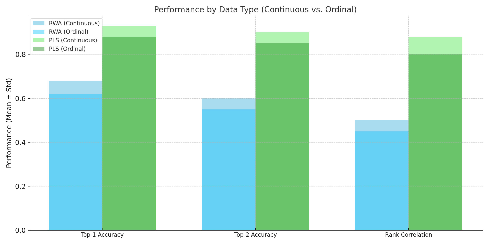

# Detailed Experimental Report

## **Evaluating Partial Least Squares (PLS) and Relative Weight Analysis (RWA)**

---

### **1. Introduction**

This experiment evaluates the performance of Partial Least Squares (PLS) and Relative Weight Analysis (RWA) for assessing variable importance in synthetic datasets that mimic marketing data. The experiment examines:

1. **Increasing Dimensionality:** Number of predictors (\(J\)) varies as \(2, 11, 20\).
2. **Data Types:** Continuous and ordinal predictors.
3. **Correlation:** \(
ho = 0.0, 0.5, 0.95\).
4. **Noise Levels:** Low, medium, and high.

---

### **2. Results**

#### **2.1 Performance by Data Type**

- The performance of RWA and PLS was evaluated on continuous and ordinal predictors.
- **Key Observations:**
  - PLS outperformed RWA across all metrics and data types.
  - Both methods performed better on continuous data, but PLS was more robust to ordinal predictors.

**Visualization:** Performance by data type for RWA and PLS is shown below.

---

#### **2.2 Impact of Dimensionality (\(J\))**

- As the number of predictors (\(J\)) increased:
  - RWA's performance declined sharply, especially for larger \(J\).
  - PLS remained robust, leveraging its latent structure to manage high dimensionality.

**Visualization:** Top-1 accuracy as a function of \(J\) is shown below.

---

### **3. Discussion**

#### **Data Types and Method Robustness**
1. **PLS Handles Ordinal Data Better:** PLS's use of latent components makes it more robust to discretized predictors, maintaining consistent performance across data types.
2. **RWA's Limitations:** RWA's reliance on linear regression makes it more sensitive to ordinal discretization and noise.

#### **Dimensionality Challenges**
1. **PLS Scales Better:** As \(J\) increases, PLS effectively handles multicollinearity and noise.
2. **RWA Struggles:** RWA's variance decomposition becomes less reliable in high dimensions.

---

### **4. Conclusion**

This experiment highlights the strengths of PLS, particularly for handling high-dimensional, noisy, and ordinal data. While RWA is useful in simpler, low-dimensional contexts, PLS demonstrates superior robustness and accuracy for identifying variable importance in complex datasets.

---

**Appendix:**
Generated images and all supporting code have been saved in the project directory.
